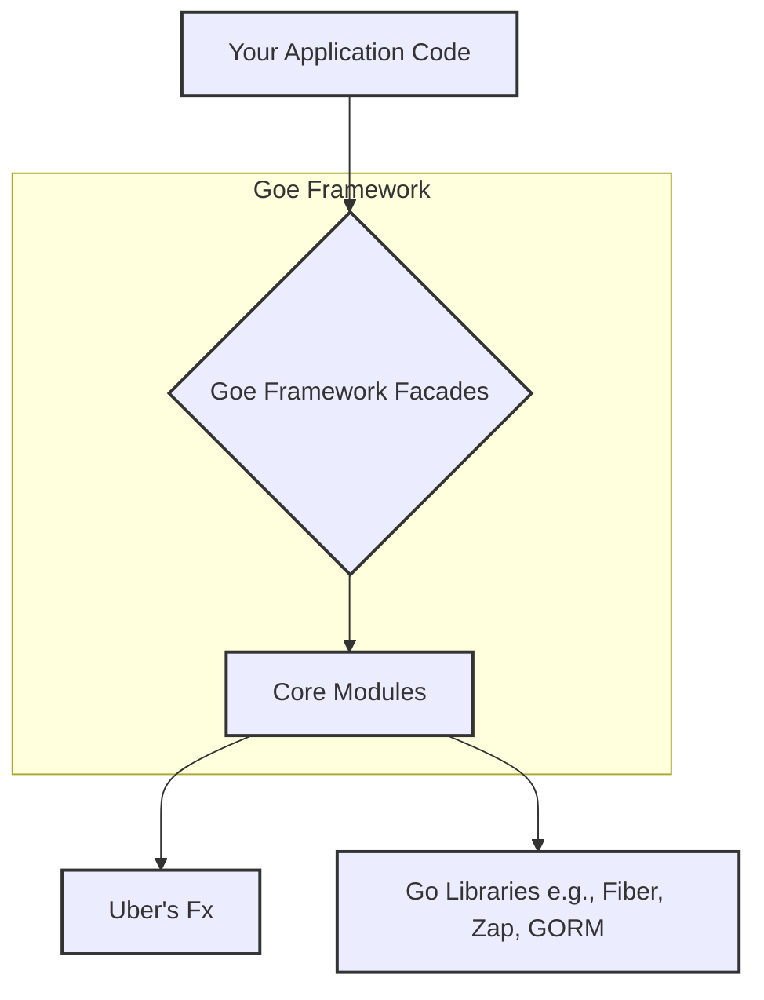

# 1. Introduction to Goe Framework 🚀

Welcome to the Goe Framework! Goe is a modern, opinionated application framework for the Go programming language, designed to accelerate the development of robust, scalable, and maintainable applications.

## 🤔 What is Goe?

Goe (Go Ease) aims to provide a delightful developer experience by integrating best practices and powerful libraries from the Go ecosystem. It's built with the philosophy that a framework should handle the boilerplate and provide sensible defaults, allowing developers to focus on business logic.

**Key Goals:**

*   **Developer Experience**: Offer an intuitive API, clear documentation, and tools that make development faster and more enjoyable.
*   **Modularity & Extensibility**: Provide a core set of features that can be easily extended or replaced through a flexible module system.
*   **Performance**: Leverage high-performance libraries and practices to ensure applications are fast and efficient.
*   **Type Safety**: Utilize Go's strong type system, complemented by Uber's Fx for type-safe dependency injection.
*   **Concurrency Safety**: Ensure that core framework components are designed to be safe for concurrent use.
*   **Best Practices Baked In**: Incorporate common patterns and best practices for configuration, logging, HTTP handling, and more.

## ✨ Core Features

Goe comes packed with features to get you productive right away:

*   **🔌 Powerful Dependency Injection**: At its heart, Goe utilizes [Uber's Fx](https://uber-go.github.io/fx/) framework. This provides:
    *   Type-safe management of application components.
    *   A clear lifecycle for application startup and shutdown.
    *   Easy testability through mockable dependencies.
*   **🌐 High-Performance HTTP Server**: Integrated with [GoFiber v3](https://gofiber.io/), a web framework built on Fasthttp, offering:
    *   Extremely fast routing and request processing.
    *   A rich set of middleware, including request logging, recovery, and request ID generation.
    *   Easy handling of requests and responses (JSON, HTML, etc.).
*   **📝 Structured & Flexible Logging**: Built on [Uber's Zap logger](https://github.com/uber-go/zap) for:
    *   High-performance, structured logging.
    *   Development-friendly pretty console output and production-ready JSON output.
    *   Configurable log levels, outputs (console, file), and context enrichment.
*   **⚙️ Environment-Aware Configuration**:
    *   Load configuration from environment variables and `.env` files (e.g., `.env`, `.env.local`, `.env.development`).
    *   Type-safe access to configuration values.
    *   Support for hot-reloading configuration (depending on the source).
*   **💾 Versatile Cache Support**:
    *   A unified caching interface built upon [Fiber's storage package](https://docs.gofiber.io/storage).
    *   Support for multiple cache drivers (In-Memory, Redis, SQLite, etc.).
    *   Easy-to-use API for common cache operations (`Get`, `Set`, `Remember`, `Forget`).
*   **🧩 Extensible Module System**:
    *   Organize your application into logical, reusable modules.
    *   Modules have lifecycle hooks (`OnStart`, `OnStop`) integrated with the Fx application lifecycle.
    *   Promotes separation of concerns and better code organization.
*   **🛡️ Contract-Driven Design**:
    *   Core components are defined by interfaces (contracts), allowing for loose coupling and easier customization or replacement of implementations.
*   **🎯 Intuitive Global Accessors & DI**:
    *   Offers convenient global helper functions (e.g., `goe.Log()`, `goe.Config()`) for quick access to core services.
    *   Simultaneously encourages and fully supports explicit dependency injection for better testability and clarity in larger applications.
*   **🔄 Concurrency Safety**:
    *   Core components are designed with thread safety in mind, ensuring reliable operation in concurrent environments.
*   **🗄️ Database Integration (GORM)**:
    *   Seamless integration with [GORM](https://gorm.io/), a popular ORM for Go.
    *   Configuration-driven setup for multiple database drivers (PostgreSQL, MySQL, SQLite, SQL Server).
    *   Connection pooling and lifecycle management.

## 🏗️ High-Level Architecture

Goe is structured in layers to promote separation of concerns and clarity:

*   **Your Application Code**: This is where your business logic, handlers, services, and domain models reside.
*   **Goe Framework Facades**: These are the entry points to Goe's functionality, including global accessors (`goe.Log()`, `goe.DB()`, etc.) and interfaces provided for dependency injection.
*   **Core Modules**: These are the built-in components of Goe (HTTP, Config, Logger, Cache, DB, etc.). Each module manages a specific concern and integrates with the Fx lifecycle.
*   **Uber's Fx**: The underlying dependency injection framework that manages the lifecycle and dependencies of all components.
*   **Go Libraries**: Goe builds upon excellent third-party Go libraries like Fiber (HTTP), Zap (Logging), GORM (Database), and Fiber's storage (Cache).

This layered approach, combined with contract-driven design and dependency injection, makes Goe a flexible and robust foundation for your Go projects.

For a more in-depth look at the architecture, please refer to the [Architecture Deep Dive](04-architecture.md) section.

Next, let's get you started with [Installation and Your First Application](02-getting-started.md).
