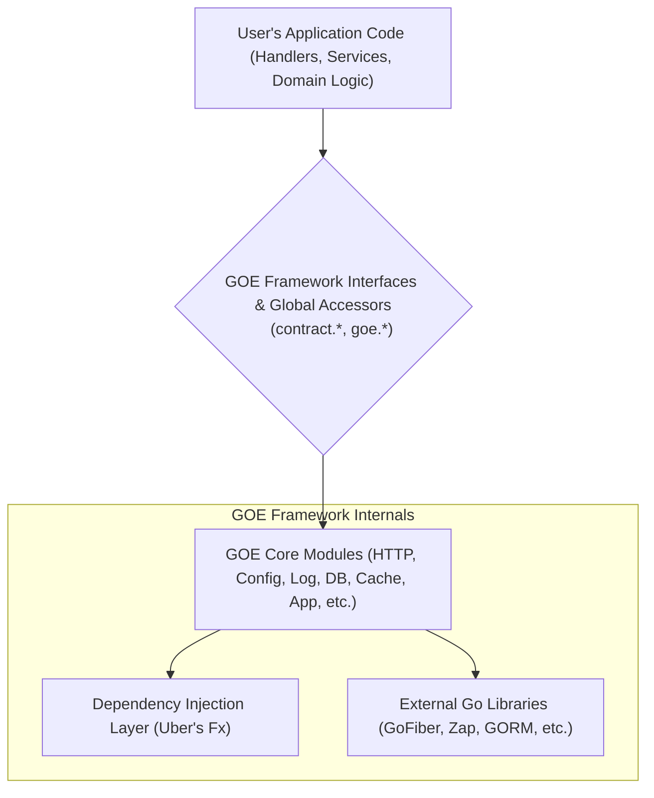
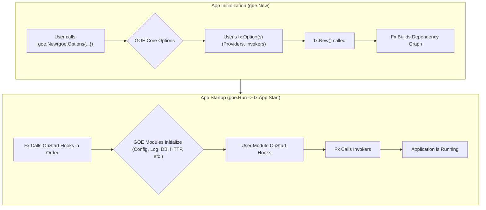
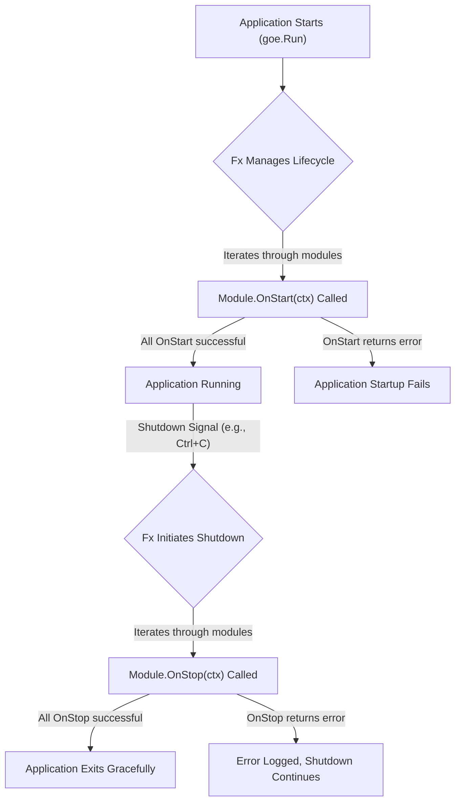
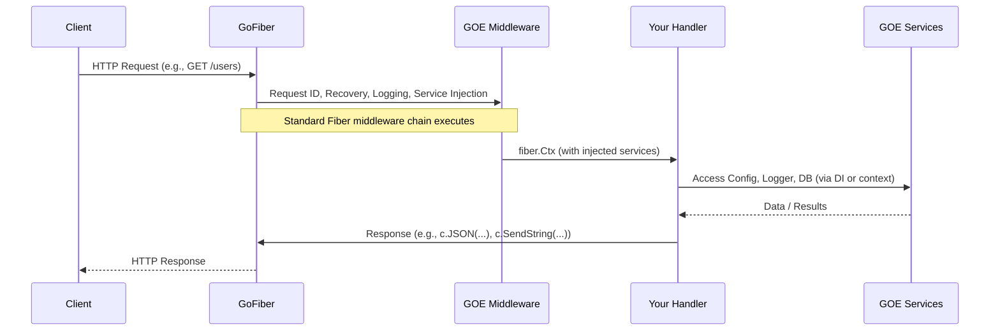

# Architecture Deep Dive

Understanding the architecture of the GOE framework is key to leveraging its full potential and building well-structured applications. This section provides a detailed look into GOE's design principles, core components, and how they interact.

## Core Philosophy

GOE is built upon several core philosophies:

* **Convention over Configuration**: While highly configurable, GOE aims to provide sensible defaults that work for most applications out-of-the-box.
* **Modularity**: The framework is designed as a set of cohesive, yet loosely coupled modules. This allows developers to use only what they need and makes the system extensible.
* **Developer Experience**: Prioritizing ease of use, clear APIs, and helpful tools to make development productive and enjoyable.
* **Leveraging the Ecosystem**: GOE doesn't reinvent the wheel. It integrates best-in-class libraries from the Go ecosystem like Uber's Fx, GoFiber, Zap, and GORM.
* **Testability**: With its contract-driven design and emphasis on dependency injection, GOE applications are designed to be easily testable.

## Layered Architecture

GOE employs a layered architecture to ensure a clear separation of concerns. This makes the framework easier to understand, maintain, and extend.



### Architecture Layers

1. **User's Application Code**: This is where your specific business logic resides. It includes your HTTP handlers, business services, domain models, repositories, and any custom modules you build. This layer interacts with the GOE framework through its defined contracts (interfaces) or convenient global accessors.

2. **GOE Framework Interfaces & Global Accessors**: These form the public API of the GOE framework.
    * **Contracts (`contract/`)**: A set of Go interfaces (e.g., `contract.Logger`, `contract.HTTPKernel`) that define the capabilities of each core module. Your application code should primarily depend on these interfaces, enabling loose coupling and testability.
    * **Global Accessors (`goe.*`)**: Static helper functions (e.g., `goe.Log()`, `goe.Config()`) that provide easy access to the default instances of core modules. Useful for convenience but dependency injection is preferred for core application logic.

3. **GOE Core Modules**: These are the pre-built components that provide essential functionalities. Each module is typically responsible for a specific concern:
    * `App`: Manages the overall application lifecycle, Fx container, and context.
    * `Config`: Handles configuration loading and access.
    * `Log`: Provides structured logging services.
    * `HTTP`: Manages the HTTP server, routing, and middleware (using GoFiber).
    * `DB`: Integrates with GORM for database operations.
    * `Cache`: Offers caching services.
    * `Observability`: Provides metrics and tracing capabilities.

4. **Dependency Injection Layer (Uber's Fx)**: GOE is built entirely on [Uber's Fx](https://uber-go.github.io/fx/). Fx is a powerful dependency injection framework that manages:
    * **Object Graph Construction**: Automatically resolves and provides dependencies to your components.
    * **Lifecycle Management**: Handles the startup and shutdown sequences of your application and its modules in the correct order.
    * **Modularity**: Fx's module system is leveraged by GOE to organize its own core modules and to allow applications to register their own.

5. **External Go Libraries**: GOE integrates and builds upon several high-quality, battle-tested Go libraries:
    * [GoFiber](https://gofiber.io/): For the HTTP layer.
    * [Zap](https://github.com/uber-go/zap): For structured logging.
    * [GORM](https://gorm.io/): For database object-relational mapping.
    * [OpenTelemetry](https://opentelemetry.io/): For observability and tracing.

## Dependency Injection with Uber's Fx

Fx is fundamental to GOE. Here's how it works:

* **Providers (`fx.Provide`)**: You "provide" constructors for your services or components. These constructors tell Fx how to create an instance of a type. The constructor's parameters are its dependencies, which Fx will resolve.
  ```go
  // Example: Providing a UserService
  func NewUserService(logger contract.Logger, db contract.DB) *UserService {
      return &UserService{log: logger, db: db}
  }
  // In your main or module:
  // fx.Provide(NewUserService)
  ```

* **Invokers (`fx.Invoke`)**: You "invoke" functions that need dependencies to perform some action during application startup (e.g., registering HTTP routes, starting a background process).
  ```go
  // Example: Registering HTTP routes
  func RegisterRoutes(httpKernel contract.HTTPKernel, userService *UserService) {
      // ... use httpKernel and userService to set up routes ...
  }
  // In your main or module:
  // fx.Invoke(RegisterRoutes)
  ```

* **Lifecycle Hooks**: Fx manages `OnStart` and `OnStop` hooks:
    * `OnStart` functions are executed when the application starts.
    * `OnStop` functions are executed when the application shuts down.
    * GOE's modules use these hooks extensively.

### Dependency Flow



1. **Initialization (`goe.New`)**:
    * The user calls `goe.New()` with options, specifying which core GOE modules to enable and any custom Fx providers or invokers.
    * GOE translates these options into `fx.Option`s.
    * `fx.New()` is called, and Fx analyzes all providers to build a dependency graph.

2. **Startup (`goe.Run()` which internally calls `fx.App.Start`)**:
    * Fx executes `OnStart` hooks for all components in dependency order.
    * Then, user-defined module `OnStart` hooks are called.
    * Finally, Fx executes all `fx.Invoke` functions.
    * The application is now considered running.

## Module System

GOE's module system allows for organizing code into manageable, independent units. Each core GOE feature (Config, Log, HTTP, DB, Cache) is implemented as a module. You can also create your own modules.

A GOE module must implement the `contract.Module` interface:

```go
package contract

import "context"

type Module interface {
	Name() string                      // Returns the unique name of the module
	OnStart(ctx context.Context) error // Called when the module starts
	OnStop(ctx context.Context) error  // Called when the module stops
}
```

### Module Lifecycle



* **`Name()`**: Provides a unique identifier for the module.
* **`OnStart(ctx context.Context)`**: Executed during application startup. Initialize resources, start background goroutines, etc.
* **`OnStop(ctx context.Context)`**: Executed during application shutdown. Release resources, stop background goroutines gracefully, etc.

## HTTP Request Lifecycle (with GoFiber)

When GOE's HTTP module is enabled, it uses GoFiber to handle incoming requests.



1. **Request Reception**: GoFiber receives an incoming HTTP request.
2. **Middleware Execution**: The request passes through a chain of middleware. GOE pre-configures several:
    * **Recovery**: Catches panics and converts them into errors.
    * **Request ID**: Assigns a unique ID to each request (useful for tracing).
    * **Service Injection**: Injects GOE services (Config, Logger, App, Validator) into the `fiber.Ctx` locals.
    * **Request Logging**: Logs details about the incoming request and its eventual response.
3. **Routing**: GoFiber matches the request path and method to a registered route.
4. **Handler Execution**: The corresponding handler function is executed.
5. **Response**: The handler generates a response using `fiber.Ctx` methods.
6. **Response Sent**: GoFiber sends the final HTTP response to the client.

## Contract-Driven Design

GOE's core components adhere to interfaces defined in the `contract/` directory. For example, `contract.Logger` defines the logging interface, which is implemented by `core/log/zap_logger.go`. This design:

* **Promotes Loose Coupling**: Your application code depends on these stable interfaces, not concrete implementations.
* **Enhances Testability**: You can easily mock these interfaces in your tests.
* **Allows Extensibility**: You could provide an alternative implementation for a core contract if needed.

## Global Accessors vs. Dependency Injection

GOE offers two ways to access core services:

1. **Global Accessors** (e.g., `goe.Log()`, `goe.Config()`):
    * **Pros**: Convenient for quick access, especially in `main.go`, scripts, or simple functions.
    * **Cons**: Can lead to less testable code if overused, as they create hidden dependencies.

2. **Dependency Injection** (via Fx):
    * **Pros**: Promotes explicit dependencies, making code easier to understand, test, and maintain.
    * **Cons**: Requires a bit more setup (defining constructors, Fx options).

GOE supports both, allowing you to choose the best approach for different parts of your application. The recommendation is to favor DI for your application's core logic and use global accessors sparingly.

## Key Design Patterns

### 1. Module Pattern
Every core component follows the module pattern:
```go
type Module struct {
    service contract.ServiceInterface
}

func (m *Module) Name() string { return "module-name" }
func (m *Module) OnStart(ctx context.Context) error { /* init */ }
func (m *Module) OnStop(ctx context.Context) error { /* cleanup */ }
```

### 2. Provider Pattern
Services are provided through constructor functions:
```go
func NewUserService(db contract.DB, logger contract.Logger) *UserService {
    return &UserService{db: db, logger: logger}
}
```

### 3. Contract Pattern
All major components are accessed through interfaces:
```go
type Logger interface {
    Info(msg string, keysAndValues ...interface{})
    Error(msg string, keysAndValues ...interface{})
    // ... other methods
}
```

This architectural overview should provide a solid foundation for understanding how GOE works. Subsequent sections will delve into the specifics of each core module.

## Next Steps

- [**Configuration**](./configuration.md) - Learn about GOE's configuration system
- [**Logging**](./logging.md) - Understand structured logging with Zap
- [**Modules**](./modules.md) - Create custom modules for your application